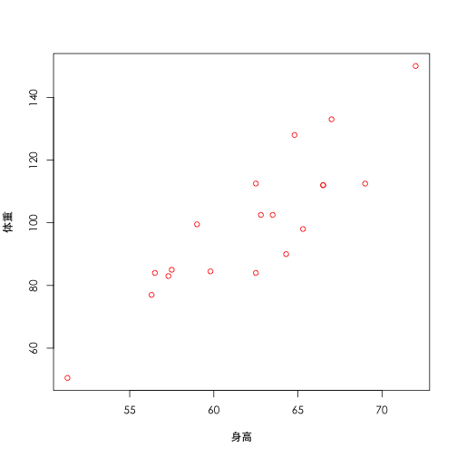
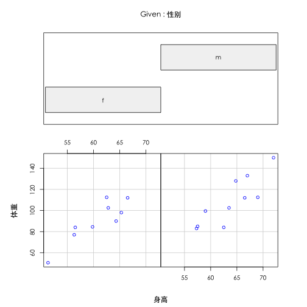
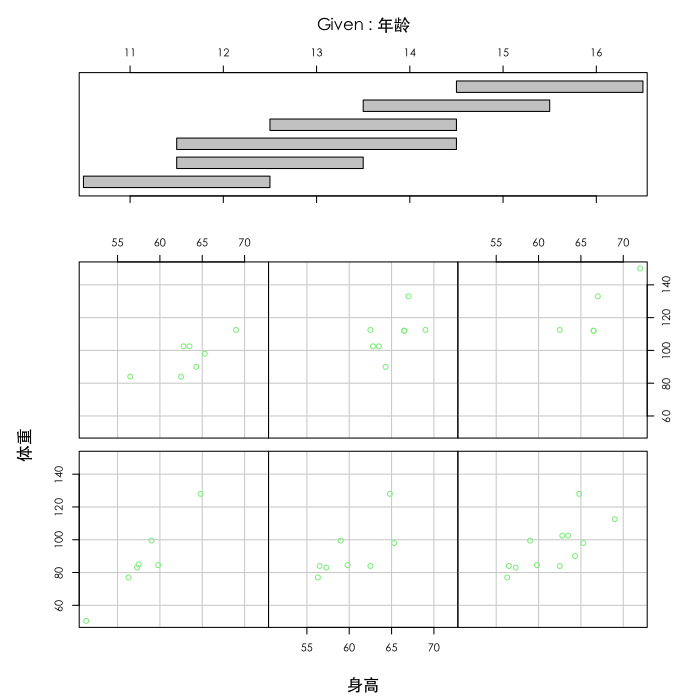
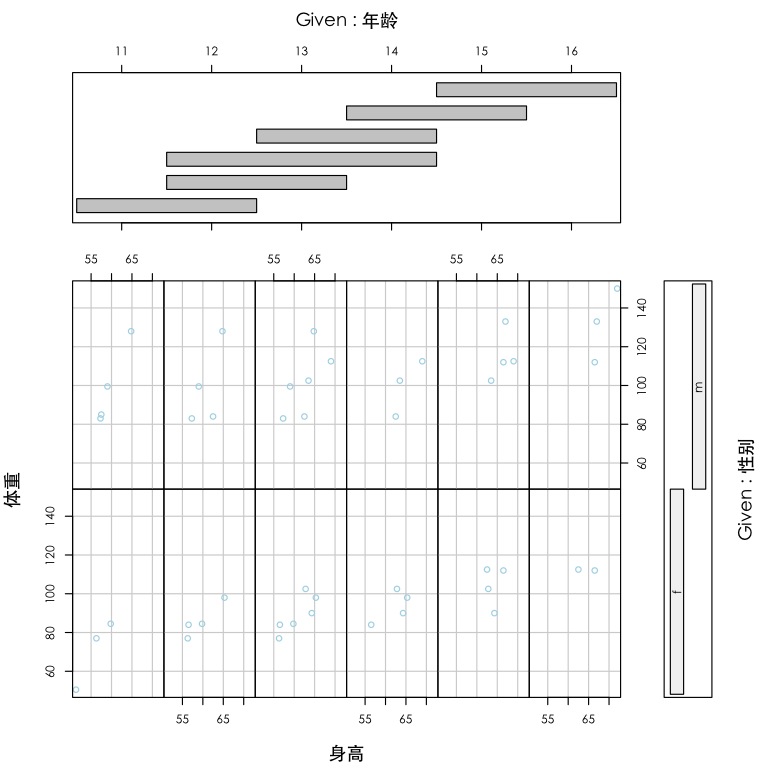
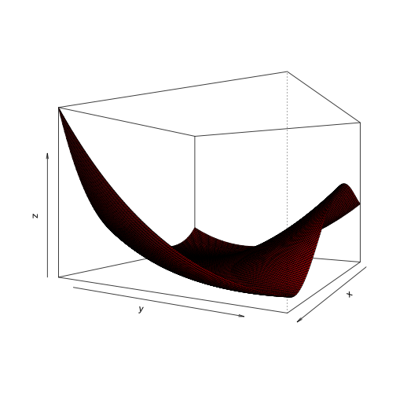
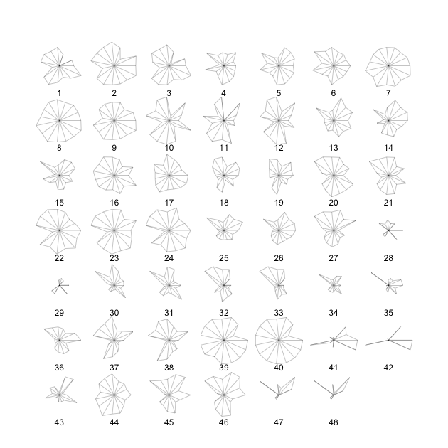
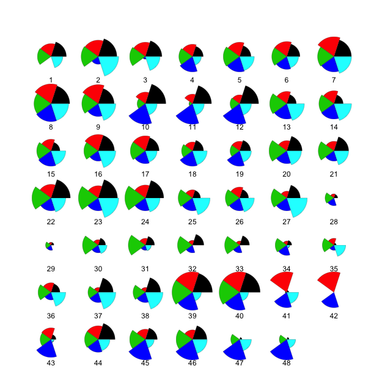
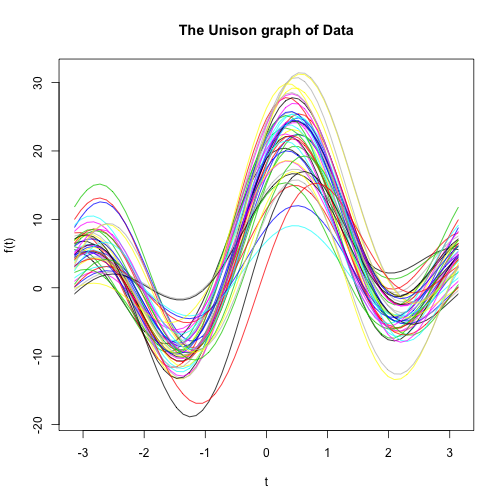

Week 2 Homework
==============
## 书面作业


### 3.5
小白鼠在接种了3种不同菌型的伤寒杆菌后的存活天数如表3.8所示,试绘制出数据的箱线图(采用两种方法,一种为``plot``语句,一种为``boxplot``语句)来判断小白鼠被注射3种菌型后的平均存活天数是否有无显著差异:
#### ``plot``方式:

```r
y <- c(2, 4, 3, 2, 4, 7, 7, 2, 2, 5, 4, 5, 6, 8, 5, 10, 7, 12, 12, 6, 6, 7, 
    11, 6, 6, 7, 9, 5, 5, 10, 6, 3, 10)
f <- factor(c(rep(1, 11), rep(2, 10), rep(3, 12)))
plot(f, y, col = "lightgray")
```

 

#### ``boxplot``方式:

```r
x <- c(2, 4, 3, 2, 4, 7, 7, 2, 2, 5, 4)
y <- c(5, 6, 8, 5, 10, 7, 12, 12, 6, 6)
z <- c(7, 11, 6, 6, 7, 9, 5, 5, 10, 6, 3, 10)
boxplot(x, y, z, names = c("1", "2", "3"), col = "orange")
```

 

**可见1组菌型对比2,3组菌型有更强的毒性**


### 3.7
某校测得19名学生的四项指标,性别、年龄、身高、体重,具体数据如表3.9所示.


#### (1)试绘制出体重对于身高的散点图

```r
plot(体重 ~ 身高, col = "red", family = "STHeiti")
```

 

#### (2)绘出不同性别情况下,体重与身高的散点图

```r
coplot(体重 ~ 身高 | 性别, col = "blue")
```

 

#### (3)绘出不同年龄段的体重与身高的散点图

```r
coplot(体重 ~ 身高 | 年龄, col = "lightgreen")
```

 

#### (4)绘出不同性别和不同年龄段的体重和身高的散点图

```r
coplot(体重 ~ 身高 | 年龄 + 性别, col = "lightblue")
```

 


### 3.8
画出函数$z=x^4-2x^2y+x^2-2xy+2y^2+\frac{9}{2}x-4y+4$在区域$-2\le x\le 3, -1 \le y \le 7$上的三维网格曲面和二维等值线,其中$x$与$y$各点之间的间隔为0.05,等值线的值为0,1,2,3,4,5,0,15,20,30,40,50,60,80,100,共15条.

```r
x <- seq(-2, 3, 0.05)
y <- seq(-1, 7, 0.05)
fun <- function(x, y) x^4 - 2 * x^2 * y + x^2 - 2 * x * y + 2 * y^2 + 4.5 * 
    x - 4 * y + 4
z <- outer(x, y, fun)  #外积运算Outer Product of Arrays,  A[c(arrayindex.x, arrayindex.y)] = FUN(X[arrayindex.x], Y[arrayindex.y]
persp(x, y, z, theta = 120, phi = 0, expand = 0.7, col = "red")  #三位网格曲面
```

 

```r
contour(x, y, z, levels = c(0, 1, 2, 3, 4, 5, 10, 15, 20, 30, 40, 50, 60, 80, 
    100), col = "blue")  #二维等值线
```

 


### 3.10
绘出例3.17中48名求职者数据的星图.


#### (1)以15项自变量FL, APP,$\ldots$,SUIT为星图的轴;

```r
stars(applicant)
```

 

#### (2)以$G1,G2,\ldots,G5$为星图的轴.

```r
df <- data.frame(G1, G2, G3, G4, G5)
stars(df, labels = 1:48, draw.segment = TRUE)
```

 

**有星图可见,8,40,39,7,23,9号确实是比较好的候选人**

### 3.11
绘出例3.17中48名求职者数据的调和曲线,以$G1,G2,\ldots,G5$为自变量

```r
G1 <- (SC + LC + SMS + DRV + AMB + GSP + POT)/7
G2 <- (FL + EXP + SUIT)/3
G3 <- (LA + HON + KJ)/3
G4 <- AA
G5 <- APP
df <- data.frame(G1, G2, G3, G4, G5)
unison(df)
```

 


