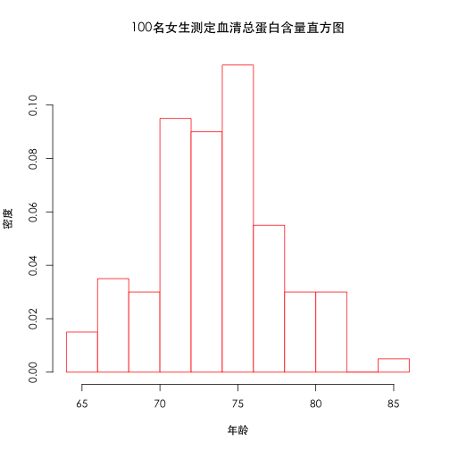
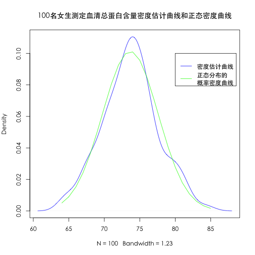
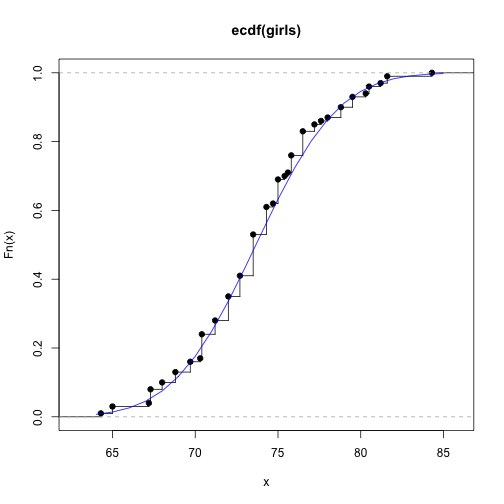
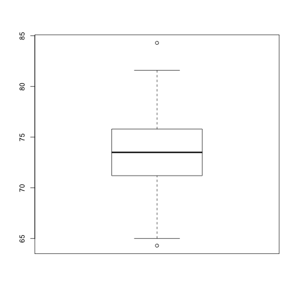
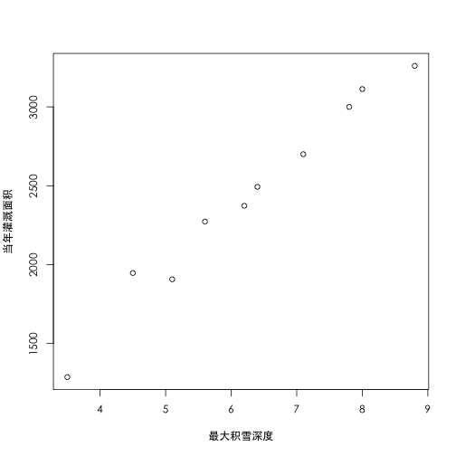

Week 3 Homework
==============
## 书面作业
### 3.1
某单位对100名女生测定血清总蛋白含量(g/L), 数据如下:


#### 计算均值、方差、标准差、极差、标准误、变异系数、偏度、峰度.

```r
data_outline(girls)
```

```
##   均值Mean 方差Var 标准差std_dev 极差R 标准误std_mean 变异系数CV 偏度系数Kurtosis 峰度系数Skewness
## 1    73.67   15.52         3.939    20         0.3959      5.347          0.03702          0.05406
```


### 3.2 
#### 绘出3.1的直方图、密度估计曲线、经验分布图、QQ图,

```r
hist(girls, freq = FALSE, col = "white", border = "red", main = "100名女生测定血清总蛋白含量直方图", xlab = "年龄", 
    ylab = "密度")
```

 

```r
qqnorm(girls, col = "purple")  #绘制QQ图
qqline(girls, col = "red")  #绘制QQ直线
```

 

#### 并将密度估计曲线和正态密度曲线比较

```r
plot(density(girls),col="blue", main="100名女生测定血清总蛋白含量密度估计曲线和正态密度曲线")
x<-64:85
lines(x,dnorm(x,mean(girls),sd(girls)),col="green") #正态分布的概率密度曲线
legend(80,0.1, # places a legend at the appropriate place 
       c("密度估计曲线","正态分布的\n概率密度曲线"), # puts text in the legend
       lty=c(1,1), # gives the legend appropriate symbols (lines)
       lwd=c(1,1),col=c("blue","green")) # gives the legend lines        
```

 

#### 将经验分布曲线与正态分布曲线相比较

```r
plot(ecdf(girls), verticals = TRUE, do.p = TRUE)  #绘制经验分布图
lines(x, pnorm(x, mean(girls), sd(girls)), col = "blue")  #正态经验分布
```

 

### 3.3
#### 绘出3.1的茎叶图、箱线图,并计算五数总括.
**茎叶图**

```r
stem(girls)
```

```
## 
##   The decimal point is at the |
## 
##   64 | 300
##   66 | 23333
##   68 | 00888777
##   70 | 344444442222
##   72 | 0000000777777555555555555
##   74 | 33333333700000004688888
##   76 | 5555555226
##   78 | 0888555
##   80 | 355266
##   82 | 
##   84 | 3
```

**箱线图**

```r
boxplot(girls)
```

 

**五数总括**

```r
fivenum(girls)
```

```
## [1] 64.3 71.2 73.5 75.8 84.3
```


### 3.4
分别用W检验方法和Kolmogorov-Smirnov检验方法检验习题3.1的数据是否服从正态分布.

#### W检验方法

```r
result <- shapiro.test(girls)
if (result$p.value >= 0.05) {
    cat("服从正态分布")
}
```

```
## 服从正态分布
```


#### Kolmogorov-Smirnov检验方法

```r
result <- ks.test(girls, "pnorm", mean(girls), sd(girls))  #注意，这里的警告信息，是因为数据中有重复的数值，ks检验要求待检数据时连续的，不允许重复值。
```

```
## Warning: ties should not be present for the Kolmogorov-Smirnov test
```

```r
result
```

```
## 
## 	One-sample Kolmogorov-Smirnov test
## 
## data:  girls 
## D = 0.073, p-value = 0.6611
## alternative hypothesis: two-sided
```

```r
if (result$p.value >= 0.05) {
    cat("服从正态分布")
}
```

```
## 服从正态分布
```


### 3.9
用Pearson相关校验法检验习题3.7中的身高与体重是否相关.

```r
students <- read.table("students.data", header = T)
attach(students)
result <- cor.test(体重, 身高, method = "pearson")
result
```

```
## 
## 	Pearson's product-moment correlation
## 
## data:  体重 and 身高 
## t = 7.555, df = 17, p-value = 7.887e-07
## alternative hypothesis: true correlation is not equal to 0 
## 95 percent confidence interval:
##  0.7044 0.9523 
## sample estimates:
##    cor 
## 0.8778
```

```r
if (result$p.value < 0.05) cat("体重~身高相关")
```

```
## 体重~身高相关
```


### 6.1 
为估计山上积雪融化后对下游灌溉的影响,在山上简历一个观测站,测量最大积雪深度$X$和当年灌溉面积$Y$,测得连续10年的数据如表6.17所示.


#### (1)试画出相应的散点图,判断$Y$与$X$是否有线性关系

```r
plot(snow_irrigation, xlab = "最大积雪深度", ylab = "当年灌溉面积")
```

 

**从图中判断, $Y$与$X$是有线性关系**

#### (2) 求出$Y$关于$X$的一元线性回归方程

```r
lm.sol <- lm(snow_irrigation$irrigation ~ 1 + snow_irrigation$snow)
```


**回归方程为$Y=140.9536+364.182X$**

#### (3) 对方程做显著性检验

```r
summary(lm.sol)
```

```
## 
## Call:
## lm(formula = snow_irrigation$irrigation ~ 1 + snow_irrigation$snow)
## 
## Residuals:
##     Min      1Q  Median      3Q     Max 
## -128.59  -70.98   -3.73   49.26  167.23 
## 
## Coefficients:
##                      Estimate Std. Error t value Pr(>|t|)    
## (Intercept)             141.0      125.1    1.13     0.29    
## snow_irrigation$snow    364.2       19.3   18.91  6.3e-08 ***
## ---
## Signif. codes:  0 '***' 0.001 '**' 0.01 '*' 0.05 '.' 0.1 ' ' 1 
## 
## Residual standard error: 96.4 on 8 degrees of freedom
## Multiple R-squared: 0.978,	Adjusted R-squared: 0.975 
## F-statistic:  358 on 1 and 8 DF,  p-value: 6.33e-08
```

$\beta1$项很显著，但常数项$\beta0$不显著。
回归方程很显著。
#### (4) 现测得今年的数据是$X=7m$, 给出今年灌溉面积的预测值和相应的区间估计($\alpha=0.05$)

```r
lm.sol <- lm(irrigation ~ 1 + snow, data = snow_irrigation)
new <- data.frame(snow = c(7))
lm.pred <- predict(lm.sol, new, interval = "prediction", level = 0.05)
```

**今年灌溉面积的预测值$Y$和预测区间为$\overset{_{\verb|^|}}Y(7)=2690.2274, [2683.6267,2696.8281]$**
